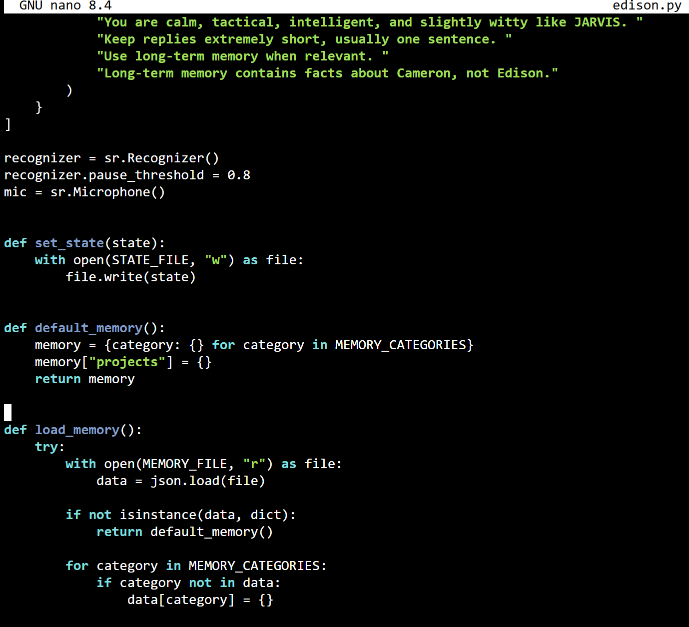
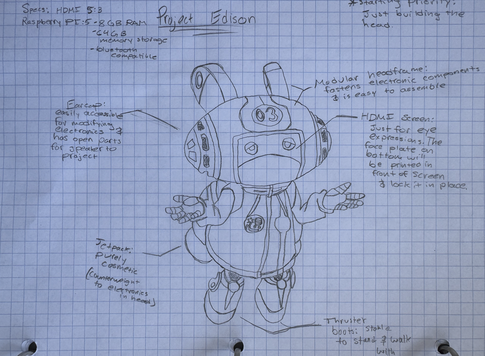
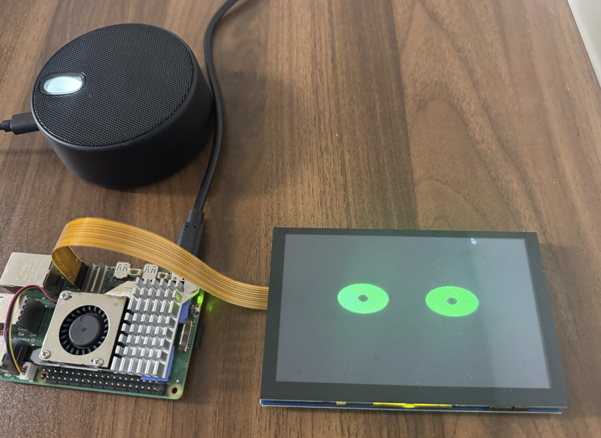
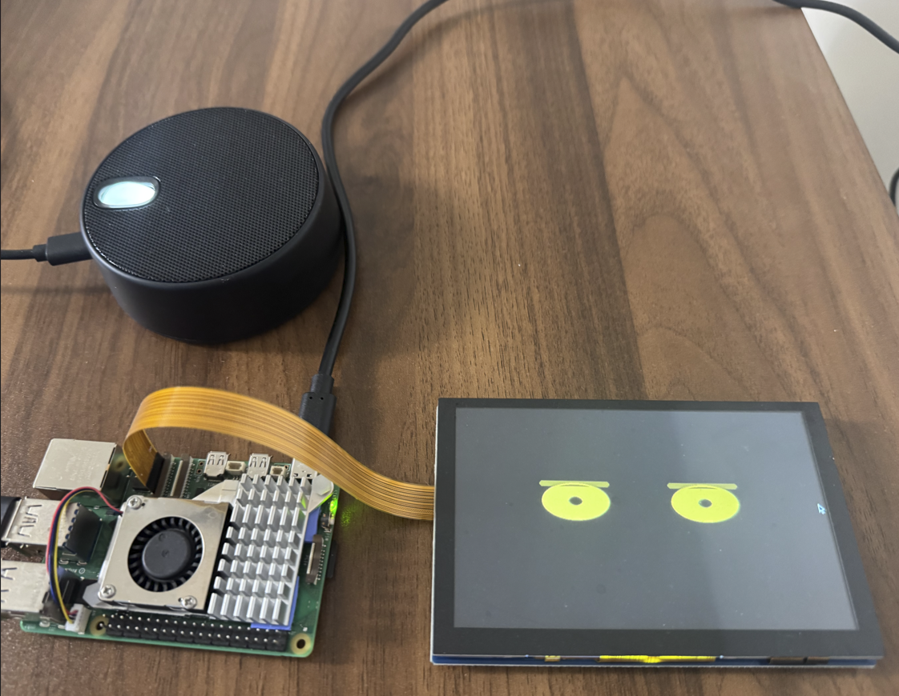
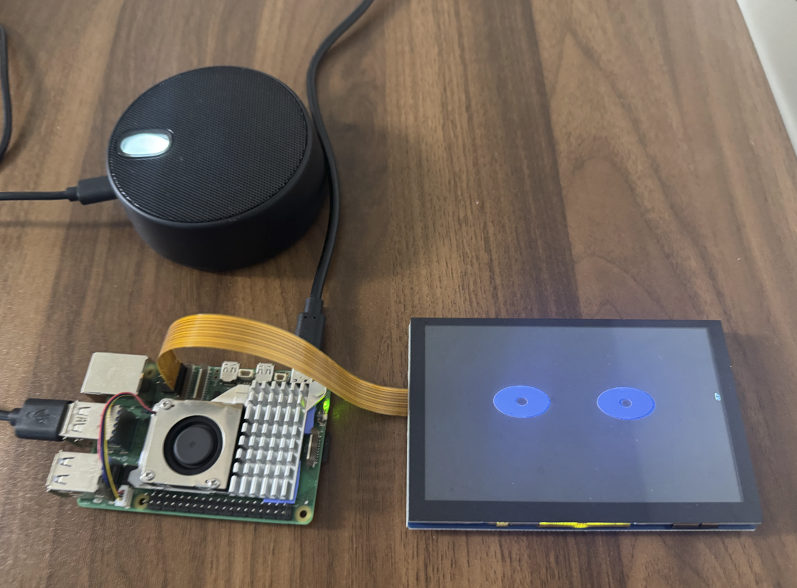
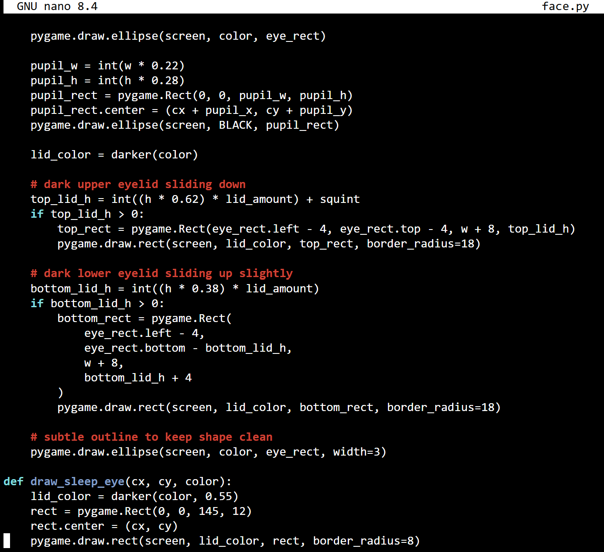
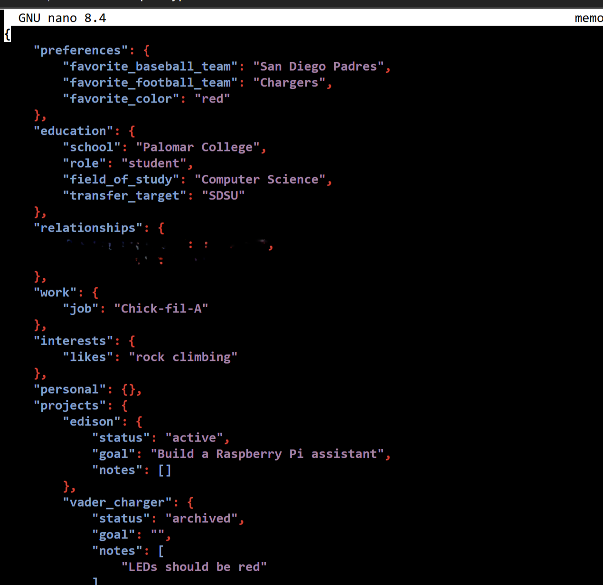
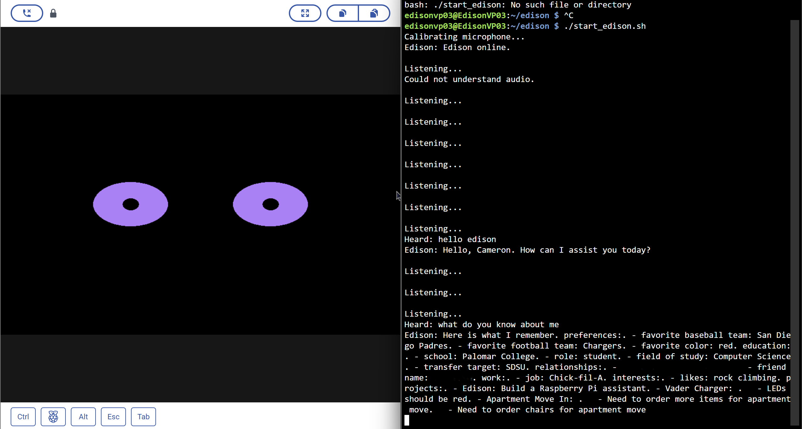
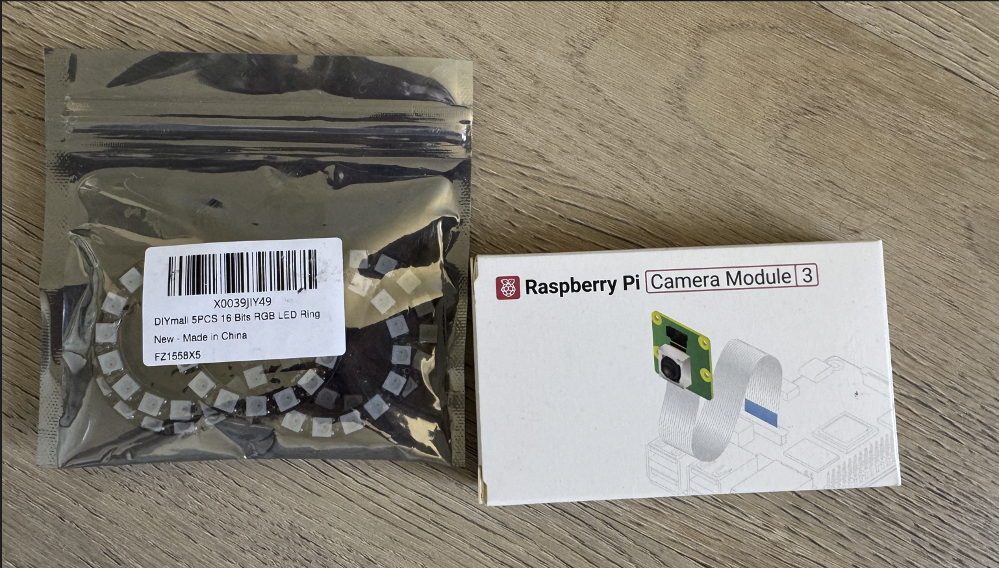

# Edison AI Desktop Assistant

A Raspberry Pi powered AI desktop assistant featuring wake-word activation, persistent memory, expressive animated eyes, local hardware integration, and conversational AI.

---

## Overview

Edison is a personal desktop assistant built on a Raspberry Pi 5 that combines voice interaction, memory, and animated facial expressions into a single physical device.

The goal of the project was to explore AI integration with embedded hardware while creating something that feels more like a living desktop companion than a traditional voice assistant.

---

## Features

- Wake-word activation ("Edison")
- Persistent long-term memory
- Conversational AI
- Animated eye expressions
- Multiple emotional states
- Local Raspberry Pi deployment
- Modular architecture for future upgrades
- Expandable hardware platform

---

## Hardware

- Raspberry Pi 5
- 5" HDMI Display
- USB Microphone
- USB Speaker
- Raspberry Pi Camera Module 3 (future upgrade)
- RGB LED Rings (future upgrade)

---

## Software

- Python
- Pygame
- SpeechRecognition
- Piper TTS
- OpenAI API
- JSON memory system

---

## Gallery

### Edison Running

*Current Raspberry Pi implementation running Edison with animated eyes.*

---

### Hardware Concept Design

*Early engineering concept for Edison's physical design. The exterior is based on the character Vegapunk Edison from One Piece, while the hardware architecture, modular frame, electronics layout, and future 3D-printed enclosure are original design concepts for this project.*

---

### Animated Expressions

#### Listening

#### Thinking

#### Speaking

*The eye display changes expression based on Edison's internal state.*

---

### Facial Animation Code

*Custom Pygame-based rendering system for expressive animated eyes.*

---

### Persistent Memory

*JSON-based long-term memory allowing Edison to remember user preferences and projects.*

---

### Memory Demonstration

*Edison recalling stored information during a live conversation.*

---

### Future Hardware

*Planned additions including the Raspberry Pi Camera Module 3 and RGB LED rings for computer vision and enhanced expressions.*
