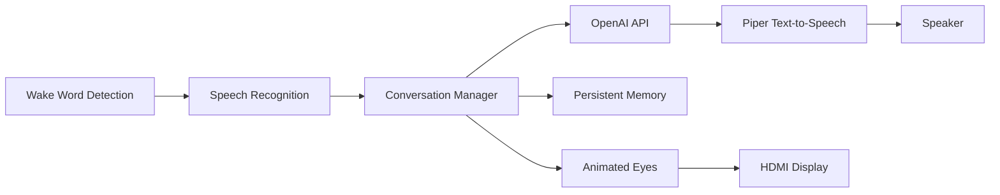

# Edison AI Desktop Assistant

A Raspberry Pi powered AI desktop assistant featuring wake-word activation, conversational AI, persistent memory, expressive animated eyes, and modular hardware designed for future expansion.

---

## Overview

Edison is a personal desktop assistant built on a Raspberry Pi 5 that combines voice interaction, memory, and animated facial expressions into a single physical device.

Rather than simply answering questions, Edison was designed to feel like a living desktop companion capable of remembering previous conversations, displaying expressive emotions, and continually evolving through future hardware upgrades.

This project serves as both a personal learning platform and a portfolio project exploring AI, embedded systems, Python development, and hardware integration.

---

## Features

- Wake-word activation ("Edison")
- Conversational AI
- Persistent long-term memory
- Animated facial expressions
- Multiple emotional eye states
- Local Raspberry Pi deployment
- Modular software architecture
- Expandable hardware platform

---

## Architecture



---

## Hardware

| Component | Purpose |
|-----------|---------|
| Raspberry Pi 5 | Main processing unit |
| 5" HDMI Display | Animated facial expressions |
| USB Microphone | Voice input |
| USB Speaker | Voice output |
| Raspberry Pi Camera Module 3 *(planned)* | Computer vision |
| RGB LED Rings *(planned)* | Visual emotion indicators |

---

## Software

- Python
- Pygame
- SpeechRecognition
- Piper Text-to-Speech
- OpenAI API
- JSON Memory System

---

## Gallery

### Edison Role


*Maps out the goal and vision for what Edison will be.*

---

### Hardware Concept Design


*Early engineering concept for Edison's physical design. The exterior is inspired by Vegapunk Edison from One Piece, while the hardware layout, modular design, electronics integration, and future 3D-printable enclosure are original design concepts created for this project.*

---

### Animated Expressions

#### Listening


#### Thinking


#### Speaking


*The eye display changes expression based on Edison's current operating state.*

---

### Facial Animation


*Custom Pygame rendering system used to generate expressive animated eyes.*

---

### Persistent Memory


*JSON-based memory system allowing Edison to remember user preferences, projects, and previous conversations.*

---

### Memory Demonstration


*Example of Edison recalling stored information during a conversation.*

---

### Future Hardware


*Future upgrades include computer vision, RGB lighting, and a custom 3D-printed enclosure.*

---

## Development Journey

Edison began as a simple Raspberry Pi voice assistant and gradually evolved into a modular AI desktop companion.

Major milestones throughout development include:

- Voice activation using a wake word
- Animated eye expressions
- Persistent memory
- Follow-up conversation mode
- Local text-to-speech using Piper
- Raspberry Pi deployment
- Hardware expansion planning

---

## Engineering Challenges

Some of the engineering challenges solved during development include:

- Managing conversation state after wake-word activation
- Reducing text-to-speech startup latency
- Synchronizing facial expressions with assistant states
- Designing a persistent memory system
- Integrating multiple Python libraries into a cohesive application
- Running the assistant reliably on Raspberry Pi hardware

---

## Project Structure

```text
Edison-AI-Desktop-Assistant
│
├── images/
├── edison.py
├── face.py
├── listen.py
├── talk.py
├── memory.json
├── start_edison.sh
└── README.md
```

---

## Code Highlights

| File | Purpose |
|------|---------|
| `edison.py` | Main application loop |
| `listen.py` | Wake-word detection and speech recognition |
| `talk.py` | Text-to-speech generation using Piper |
| `face.py` | Animated facial rendering |
| `memory.json` | Persistent memory storage |

---

## Roadmap

### Completed

- [x] Wake-word activation
- [x] Conversational AI
- [x] Persistent memory
- [x] Animated facial expressions
- [x] Raspberry Pi deployment
- [x] Local Piper voice synthesis

### Planned

- [ ] Custom 3D-printed enclosure
- [ ] Raspberry Pi Camera Module 3 integration
- [ ] RGB LED emotion lighting
- [ ] Computer vision
- [ ] Voice identification
- [ ] Local LLM support
- [ ] Home automation integration

---

## Lessons Learned

Building Edison strengthened my experience with:

- Designing modular Python applications
- Integrating AI APIs with physical hardware
- Managing long-running application state
- Building software for embedded Linux systems
- Combining local and cloud-based AI technologies
- Rapid prototyping of hardware and software together

---

## Future Vision

The long-term goal is for Edison to become a fully interactive desktop companion with expressive animations, computer vision, environmental awareness, and custom-built hardware housed in a fully 3D-printed enclosure.

Rather than serving only as a voice assistant, Edison is intended to evolve into a modular AI platform that continues to grow alongside new hardware capabilities and software features.
